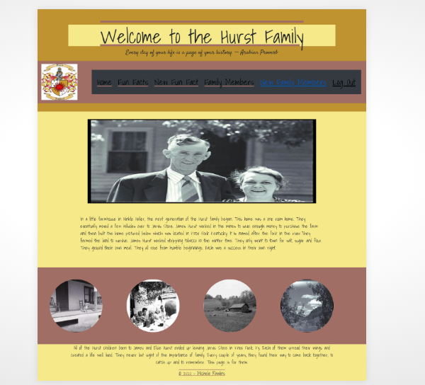
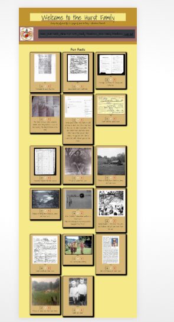
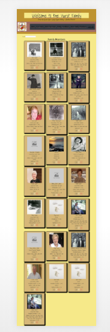

This project was bootstrapped with [Create React App](https://github.com/facebook/create-react-app).

Link to deployed site:

 https://hurst-family-f893c.web.app

## Technologies Used:
HTML, CSS and Javacript,
React,
Bootstrap,
JQuery,
Sass,
Firebase(database and hosting)

## Introduction
Welcome to the family.  This application is for the Hurst Family.  It allows them to view Fun Facts and Family Members, Edit Fun Facts and Family members, Add Fun Facts and Family Members or Delete Fun Facts and Family Members.  

## Screenshots:

## How to Run

Clone down this project.
Create apiKeys.json file using the template apiKeysExample.json with your own firebase keys added.
Install http-server from npm.

In the project directory, you can run:

### `npm start`

Runs the app in the development mode. 
Open [http://localhost:3000](http://localhost:3000) to view it in the browser.

The page will reload if you make edits. 
You will also see any lint errors in the console.

## Learn More

You can learn more in the [Create React App documentation](https://facebook.github.io/create-react-app/docs/getting-started).

To learn React, check out the [React documentation](https://reactjs.org/).

